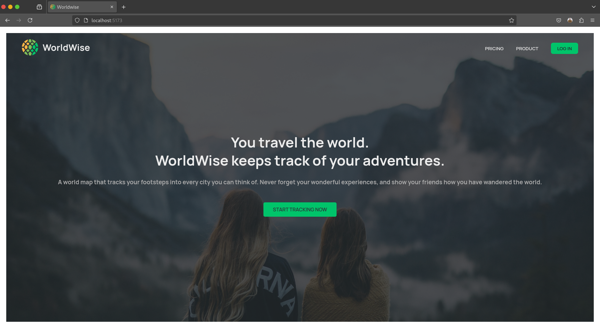
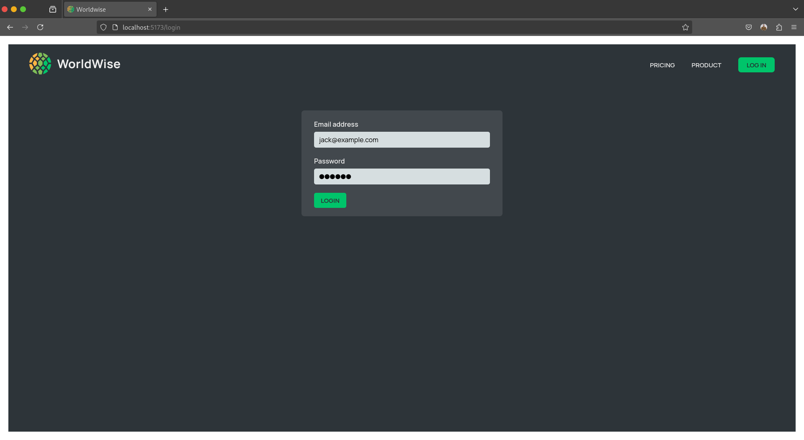
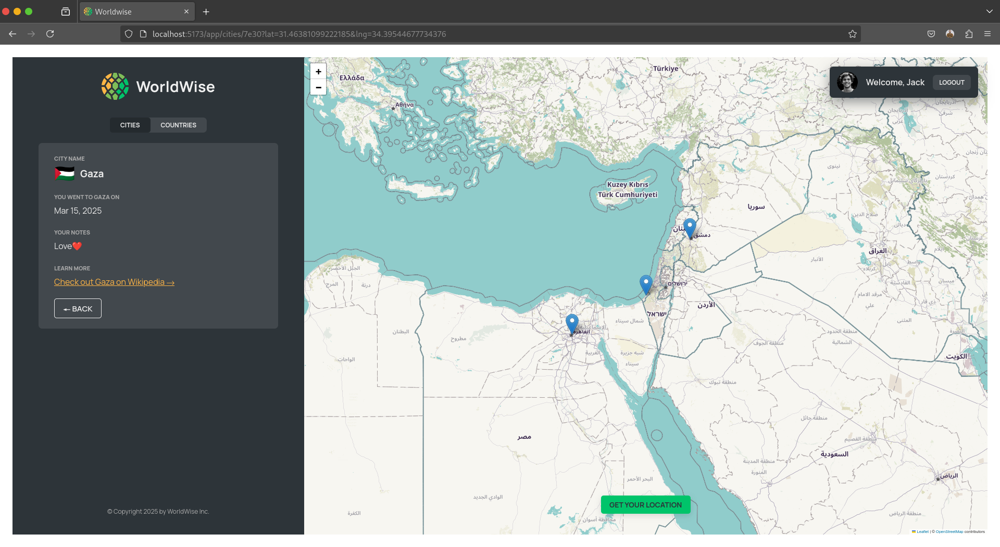

# WorldWise 🌍

**WorldWise** is a travel tracking web application that allows users to document their journeys, add notes to locations, and maintain lists of cities and countries they plan to visit or have already explored.

## 🌟 Features

- **Interactive Map**: View and explore locations using an interactive world map.
- **Journey Tracking**: Add cities and countries you've visited with personal notes.
- **Future Destinations**: Keep a list of places you plan to visit.
- **Rich User Experience**: Built with modern React features, ensuring a smooth and responsive UI.
- **Routing & Navigation**: Implemented using React Router for seamless navigation.
- **State Management**: Utilizes Context API and `useReducer` for efficient global state handling.

## 🚀 Technologies Used

- **React.js**: Modern front-end library for building dynamic UIs.
- **React Router**: Enables smooth page transitions.
- **Context API & useReducer**: Manages state efficiently.
- **Leaflet & OpenStreetMap**: Provides the interactive mapping experience.
- **Styled Components**: Enhances styling with modular CSS-in-JS.

## 📸 Screenshots

### Screenshot 1


### Screenshot 2


### Screenshot 3


## 📂 Installation & Setup

1. **Clone the repository**
   ```sh
   git clone https://github.com/Mos3aB696/Worldwise.git
   cd Worldwise
   ```

2. **Install dependencies**
   ```sh
   npm install
   ```

3. **Run the development server**
   ```sh
   npm run dev
   ```
   The application will be available at `http://localhost:5173/`.

## 🎯 Usage

1. **Sign in** to track and manage your journeys.
2. **Explore the map** to find and mark visited cities.
3. **Add notes** to places you've visited.
4. **Plan future trips** by adding locations to your wishlist.
5. **View country lists** to see where you've been and where you want to go next.

## 📌 Roadmap

- ✅ Add authentication for personalized tracking.
- ✅ Improve map UI with additional features.
- ⏳ Integrate social sharing options.
- ⏳ Mobile responsiveness improvements.

## 🤝 Contribution

Contributions are welcome! If you'd like to contribute:
1. **Fork the repository**
2. **Create a feature branch** (`git checkout -b feature-name`)
3. **Commit changes** (`git commit -m "Add new feature"`)
4. **Push to GitHub** (`git push origin feature-name`)
5. **Open a Pull Request**

## 📬 Contact

**Mosaab Abdelkawy**
- [Portfolio](https://mos3ab.tech)
- [LinkedIn](https://www.linkedin.com/in/mosaab-abdelkawy/)
- [YouTube](https://youtube.com/@tapseta)

---

🌍 *WorldWise - Track your journey, plan your future, and explore the world!*
